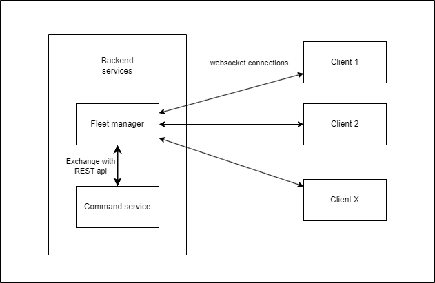

# Design choices

I have decided to choice a microservices code structure using websockets connection for the backend architecture. This choice have been made and it might not be the more optimal depending of the use case.

- Rust Backend servers using warp framework for fast REST api and Websockets connections
- Agent can subscribe to topics in the server and receive commands send to there following topics
- serialized JSON request
- C++ distant Agents 


## Backend details



Rest api endpoints :

- /health : check fleet_manager service status
- /register : register a new client id, stored on a shared hash map and assign it to a default topic
- /publish : publish a message to every clients subscribed to the selected topic
- /ws : websockets connections
- /add_topic : allow agent to manage topics
- /remove_topic : allow agent to manage topics


# Possible evolution
- Postgre Database using Diesel ORM : long terme storage and follow up of every clients on the network.

- Implement REST api in command service to receive clients results or access via database

- And way more...

# How to run

## Server

### Requirements

- Rust installed

### Running services

```
cd server
cargo run --bin {service_name}
```

Services available :
- fleet_manager : start a REST server capable of creating Websockets endpoints and establish connection with clients
- command_service : send a simple test command to clients via the fleet_manager service. Once started send `s {text to send} {delay until clients respond (random up to this delay)}`

## Client

### Requirements

- c++ compiler such as gcc installed
- cmake installed

### Installation

clone submodules with :
```
git clone --recurse-submodules -j8 git@github.com:LJoyL/fleet-management.git
```
or
```
git clone git@github.com:LJoyL/fleet-management.git
git submodule update --init --recursive
```

Then build client apps:
```
cd client
mkdir build
cd build
cmake .. && cmake --build .
```

### Running apps
```
cd build
./{AppName}
```

Available apps
- commandAgentApp : run a single agent, verbose mode
- multiCommandAgentApp : run multiple agents, first parameter is the amount (default: 10). ex: `./multiCommandAgentApp 100`


## Example use

Open 3 terminal windows with each of the server services and with the multiCommandAgentApp :
```
cd server
cargo run --bin fleet_manager
```

Warning, the fleet_manager service need to be started before the clients are started or they will stop immediately.
```
cd client/build
./multiCommandAgentApp
```

```
cd server
cargo run --bin command_service
```
Then enter :
```
s
or
s "Happy New Year" 5
```